# Notice de montage du robot suiveur de ligne

## Circuit électronique

Voici le shéma global :

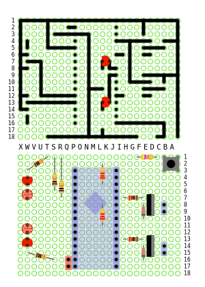

La première face correspond aux pistes à créer sur la plaque à pastilles.

La seconde face est le côté composants.

### Les connecteurs femelles qui recevront l'arduino

* Prendre 2 rangées de connecteurs Pin femelles.
* Avec une pince coupante, les couper au milieu de la 16ème PIN, de façon à ce que 15 pins soient utilisables.

* Les placer sur la plaque de prototypage.

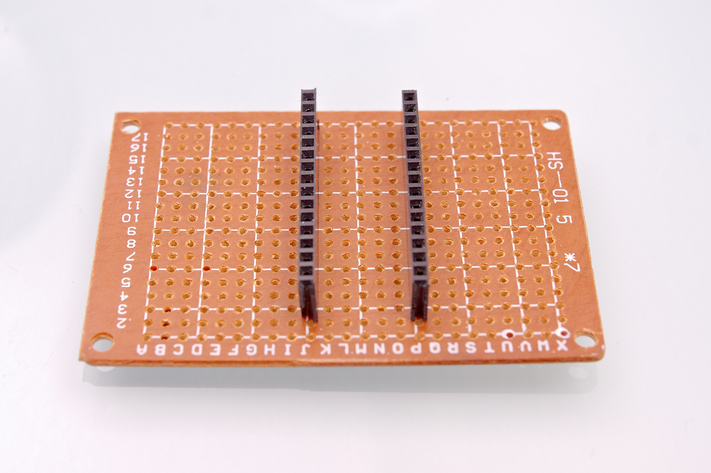

* Côté circuit, souder chaque pin:

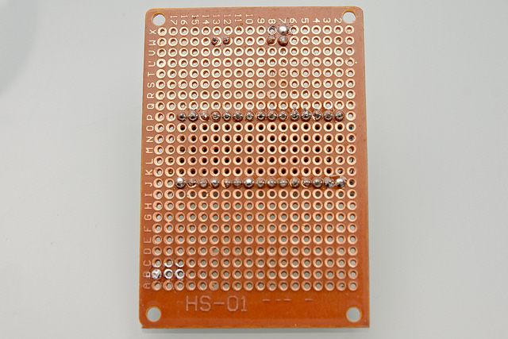

### La piste de masse

Afin de vous faire la main avec les soudures, Faites tout le circuit 5V (en rouge):

* En faisant en sorte que la continuité soit respectée.
* Sans déborder sur les pastilles d'à côté.

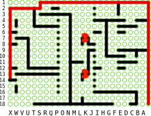

### Souder quelques composants

* Coté composants de la plaque, placer ces trois résistances:

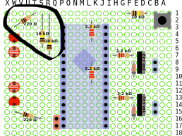

* Coté circuit, mettre un point de soudure sur les pattes des résistances pour les fixer (points marqués en rouge).

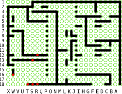

* Raccorder ces résistances à la masse de l'arduino:

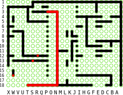

Raccorder deux de ces résistances aux pins de l'arduino:

### Continuez !

Voila, vous avez compris, il faut placer les composants un par un, les souder et faire les lignes d'étain pour les relier conformément au circuit.

Le pas à pas s'arrète ici car c'est fastidieux à écrire. Continuez composant par composant, goute d'étain par goute d'étain.

Quelques subtilités cependant pour la suite:

#### Certains composants sont polarisés:

* Les LEDs; Sur le schéma, elles sont représentées vue de dessus. Le côté ayant un plat y est représenté. Disposez la LED sur votre circuit dans le même sens que sur le schéma.
* Les diodes; Un anneau noir est dessiné sur les diodes. Disposez-les en respectant le côté de l'anneau.
* Les transistors

#### le capteur doit froler le sol
Les LEDS et les photoresistances du capteur de ligne doivent être soudées de façon:
* la photoresistance doit être le plus près possible du sol
* La led ne doit pas éclairer directement la photoresistance, ses pattes doivent être plus courtes.

Comme ceci:

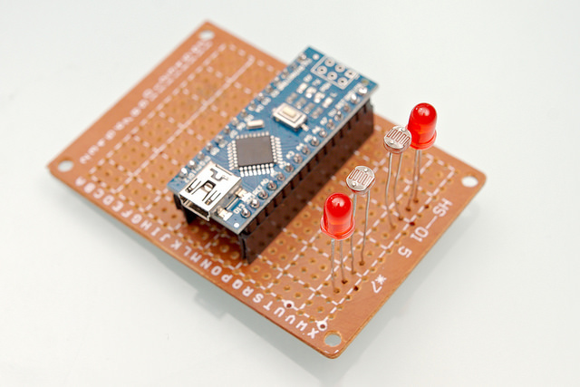

#### Composants sur l'autre face

Les Leds de Debugage doivent être côté circuit de la plaque, et non du même côté que les autres composants, afin qu'à la fin elles se retouvent au dessus du circuit.

## Arduino

Il faut souder les broches de l'arduino:

Le port USB doit être sur la face opposée aux broches.

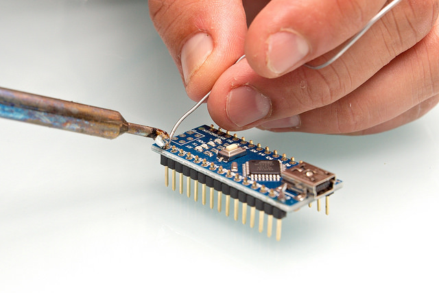

## Fils  avec connecteurs Dupont sur les moteurs

Coupez un cable avec connecteurs Dupont male, dénudez-le et soudez-le sur les connecteurs du moteur. Comme ceci:

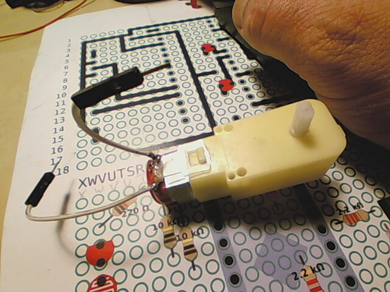

Longueur du fil, avec le connecteur: env. 7cm

## Tout assembler

Si nécessaire, contre-percez les trous dans le chassis et la plaque de prototypage.

Quelques coups de tourne-vis et vous aurez votre robot.

Il faut faire en sorte que les capteurs soient très près du sol.

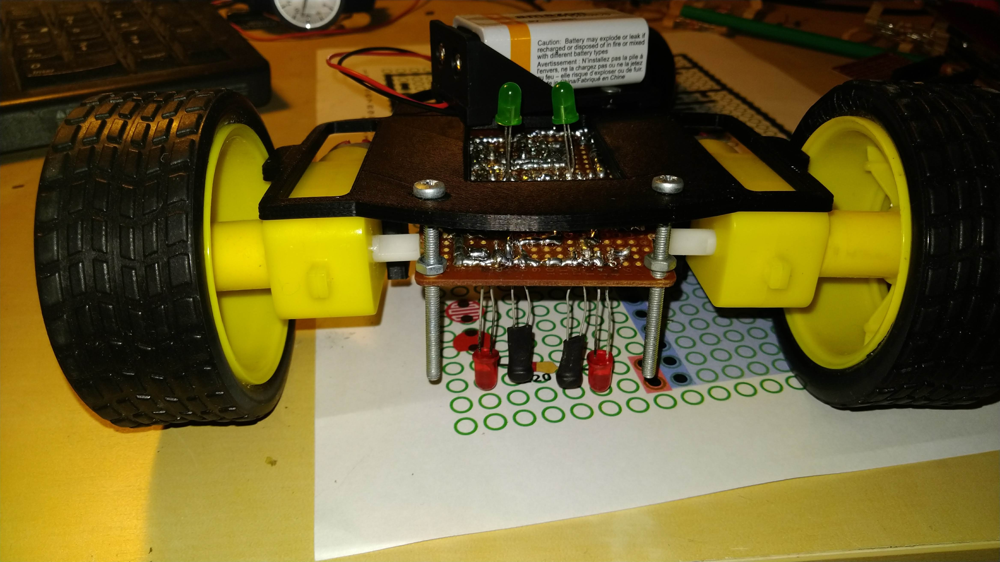

## Injecter le code dans l'arduino.

Il faut programmer l'arduino.

L'installation de l'environnement Arduino est expliquée sur le site officiel. https://www.arduino.cc/

Le programme servant à faire fonctionner le robot suiveur de ligne  peut être téléchargée sur la plateforme Gogs (git) du hackerspace:

https://git.ventresmous.fr/VentresMous/lineFollowerBot/src/master/lineFollowerBot/lineFollowerBot.ino

Nous vous détaillerons ces manipulations durant l'atelier.
