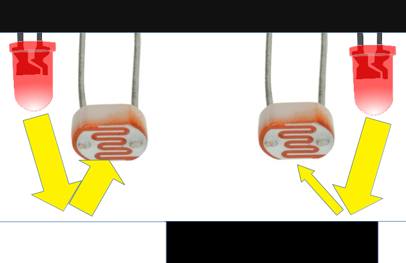
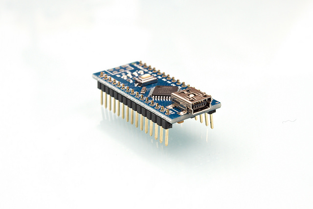

# Notice de montage du robot suiveur de ligne

## Principes

### Détection de la ligne

Un sol clair reflète plus la lumière qu'un sol sombre.

En disposant de cette manière, deux LED et deux photoristances:

La valeur de chaque photoresistance dépend de la quantité de lumière reflétée par le sol.

Sur le schéma ci dessus la lecture des valeurs des photorésistances permettrait de déduire que celle de droite est au dessus d'une ligne noire. Tandis que celle de gauche est au dessus d'une zone claire.

Le robot dérive donc vers la droite de la ligne. Il faut le faire tourner à gauche

### Actionner les moteurs en fonction des valeurs du capteur.

#### Présentation de l'arduino

L'arduino est un circuit électronique programmable pouvant "lire des valeurs" via certaines pins, et déclencher des courants électriques via d'autres pins.

Grâce à cette carte pouvoir "lire" les valeurs des capteurs de luminosité, et notre programme, en fonction de ces valeurs actionnera ou non l'envoi d'une tension électrique dans les moteurs.

#### Lecture d'une valeur

#### déclenchement d'un moteur

## Fabriquer le circuit imprimé du robot

Voici le shéma global:

La première face correspond aux pistes à créer sur la plaque à pastille.

La seconde face est le coté composants.

### Les connecteurs femelles qui recevront l'arduino

* Prendre 2 rangées de connecteurs Pin femelles.
* Avec une pince coupante, les couper au milieu de la 16ème PIN, de façon à ce que 15 pins soient utilisables

* les places sur la plaque de prototypage

* Souder chaque points des connecteurs:

