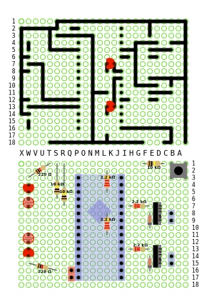

# Notice de montage du robot suiveur de ligne

Voici le shéma global:

La première face correspond aux pistes à créer sur la plaque à pastille.

La seconde face est le coté composants.

## Les connecteurs femelles qui recevront l'arduino

* Prendre 2 rangées de connecteurs Pin femelles.
* Avec une pince coupante, les couper au milieu de la 16ème PIN, de façon à ce que 15 pins soient utilisables

* les places sur la plaque de prototypage

* Souder chaque points des connecteurs:

## La piste 5V et le Ground

Afin de vous faire la main avec les soudures, Faites tout le circuit 5V (en rouge):

* En faisant en sorte que la continuité soit respectée.
* Sans déborder sur les pastilles d'à coté.

## Souder quelques composants

* Coté composants de la plaque, placer ces trois résistances:

* Coté circuit, mettre un point de soudure sur les pates des résistances pour les fixer (points marqués en rouge).

* Raccorder ces résistances à la masse de l'arduino 

